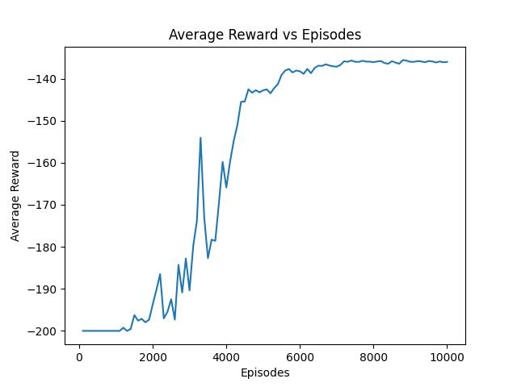
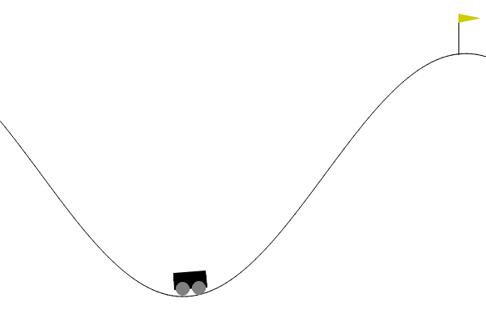
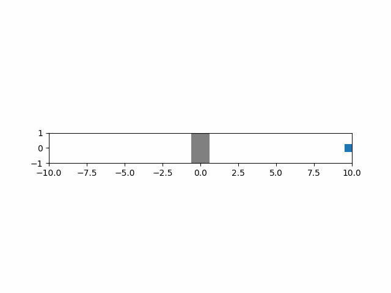
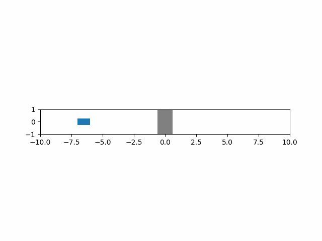
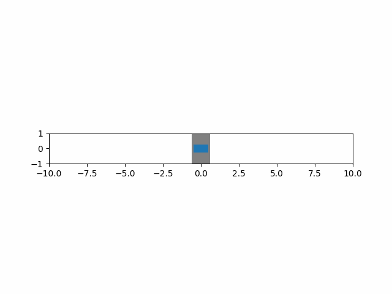

# Reinforcement learning repository
## Mountain Car 
Lifted from https://gist.github.com/gkhayes/3d154e0505e31d6367be22ed3da2e955 with minor modifications.

 
```bash
python mountain_car.py
```
This command took 1 min to run and produced the following plot (reward is equal to the number of time steps until it reaches the goal)



A simulation of the mountain car is shown below:


## Car

Task is to return a car to the origin in minimum time.
The equations of motion of the car are:
$$
\begin{align*}
\dot{v} &= u - c_d v|v|\\
\dot{x} &= v 
\end{align*}
$$

This was done with deep Q learning and example trajectories are shown below. Training took around 1 hour:



